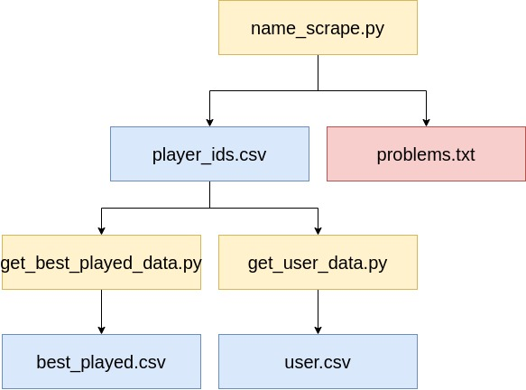

# Data Mining   

This repository is the first part of a light data analysis. In this repo, I demonstrate how I collected the data I'll be using in the ‘osu_data_visualizations’ repo. This basically boils down to using python to use the site's old API service found [here](https://github.com/ppy/osu-api/wiki).  

## Requirements 

- Python 3.7.3 or greater 

- An Osu! account (to obtain the following)

- An [API key](https://osu.ppy.sh/forum/ucp.php?mode=login). 

## Description of tables  

Datasets `user.csv`, `user2.csv`, and `user3.csv` have the same table structure. Likewise, datasets `best_played.csv`, `best_played2.csv`, and `best_played3.csv` have the same table structure. They should be thought of as a continuous dataset. They were broken up into parts for the sake of not have just one large dataset.   

Before describing what the columns mean, I will briefly describe the game mechanics: Users play along to songs. In particular, players click circles according to the *beat* of the song. A player's accuracy is determined by how close they clicked the circles to the beat. Playable songs are known as beatmaps or just maps. Some maps are more difficult than others. Players that play more difficult maps can potentially own more performance points (abbreviated as 'pp'). 

The game's leader board is centered around a player's overall performance. A player's overall performances is based on a weighted sum of their "best performances". A player's top 50 performances consist of maps that has earned them the most *pp*. 

The game is not centered around performance points. Players can take an artistic approach to the game and create their own maps. A ranked map is a map that is approved by the community. Plays with ranked maps are counted toward a player’s overall performance (if a high score was achieved). 

Users can play offline (not connected to servers or internet) or online. If online, their performances can be recorded in their history. In particular, their performances ratings on maps are recorded. A map rating is based on things like accuracy, score, and modifiers. They are usually one of the following: SSH (100% accuracy w/modifiers), SS(100%), SH (>~95% with modifiers), S(>~95%), and A (~>90%). A map modifier is something that makes a said map more difficult. Playing with a modifier(s) can give a player a higher score potential and greater pp return.

Now that I covered the how the game works, we can move onto the table descriptions.  
 
For the `usersX.csv` files:

 | Attribute         | Description                                                                          | Notes                                                                               |
|----------------|--------------------------------------------------------------------------------------|-------------------------------------------------------------------------------------|
| user_id        | A player's  unique ID                                                                | Attached to the account. Independent of player's name.                              |
| username       | The user's current public game-name                                                      | Could change.                                                                       |
| join_date      | The time the account was created.                                                    |                                                                                     |
| count300       | The number of times a user has clicked a circle 'accurately'                         | Margin of error is based on specific beatmap.                                       |
| count100       | The number of times a user has clicked a circle 'almost accurately'                  | Margin of error is based on specific beatmap.                                       |
| count50        | The number of times a user has clicked a circle 'just barely in time'                | Margin of error is based on specific beatmap.                                       |
| playcount      | The number of times a user has played a map.                                         | If the user was online.                                                             |
| ranked_score   | The total sum of all best score/performance for every map every played.              | Scores that were achieved online and gained from ranked maps.  |
| total_score    | The total sum of all top scores for every map. |                                                                                     |
| pp_rank        | The user's global rank.                                                              | Based on overall performance.                                                       |
| accuracy       | The average accuracy for every (best played) performance.                            |                                                                                     |
| count_rank_ss  | The number of `SS` rated performances.                                               | You can only get one performance rating per map.                                    |
| count_rank_ssh | The number of silver `SS` rated performances.                                        | You can only get one performance rating per map. These are achieved with map modifiers. |
| count_rank_s         | The number of `S` rated performances.        | You can only get one performance rating per map.                                        |
| count_rank_sh        | The number of silver `S` rated performances. | You can only get one performance rating per map. These are achieved with map modifiers. |
| count_rank_a         | The number of `A` rated performances.        | You can only get one performance rating per map.                                        |
| country              | The country the user is from.                | Could change.                                                                           |
| total_seconds_played | The total time the user has played online.   |                                                                                         |
| pp_country_rank      | The user's rank relative to their country.   | Also based on overall performance.                                                      |

Map ratings are generally based on accuracy and the number of misses. I believe 95% accuracy with no misses gives a player an `S` rating.

The performance points gained from a paritcular beatmap is described by a function. More about it [here](https://osu.ppy.sh/help/wiki/Performance_Points).

The `best_playedX.csv` files are essentially a list of top performances of every player from above. 

| Attribute    | Description                                                                           | Comment                                                                           |
|--------------|---------------------------------------------------------------------------------------|-----------------------------------------------------------------------------------|
| beatmap_id   | The maps unique ID                                                                    | A specific song can have more than one ranked map for it (from different artists) |
| score_id     | The ID for the score                                                                  | I think this refers to specific replays.                                          |
| score        | The score achieved by player.                                                         | A max number exists per map.                                                      |
| maxcombo     | The longest streak of circles clicked without misses.                                 | A max number exists per map.                                                      |
| count50      | Number of "just barely in time" clicks.                                               | Margin of error varies per map. Also depends on modifiers.                        |
| count100     | Number of "almost" clicks.                                                            | Margin of error varies per map. Also depends on modifiers.                        |
| count300     | Number of "good/perfect" clicks.                                                      | Margin of error varies per map. Also depends on modifiers.                        |
| countmiss    | Number of missed clicks/notes/beats.                                                  | Margin of error varies per map. Also depends on modifiers.                        |
| countgeki    | Number of sub-combos or combosets perfectly completed.                                | A max number exists per map.                                                      |
| countkatu    | Number of sub-combos or combosets completed/achieved with less than perfect accuracy. | A max number exists per map.                                                      |
| perfect      | Bool value. 1 == max combo of map reached, 0 otherwise.                               | See table below.                                                                  |
| enabled_mods | The map modifiers used in this play.                                                  | See table below.                                                                  |
| user_id      | The player's unique ID.                                                               |                                                                                   |
| date         | Date play was achieved.                                                               |                                                                                   |

The number that is described by "enabled_mods" is referring the following table: 

| Modifier    | Value |
|-------------|-------|
| None        | 0     |
| NoFail      | 1     |
| Easy        | 2     |
| TouchDevice | 4     |
| Hidden      | 8     |
| HardRock    | 16    |
| SuddenDeath | 32    |
| DoubleTime  | 64    |
| Relax       | 128   |
| HalfTime    | 256   |
| NightCore   | 512   |
| Flashlight  | 1024  |
| Autoplay    | 2048  |
| SpunOut     | 4096  |
| Relax2 (Autopilot) | 8192  |
| Perfect            | 16384 |

This isn't the exhaustive list. Refer to the osu-api version 1 for the full list. 

The file known as `player_ids.csv` is just a list of `user_id`s. They are mostly sorted according the user's global ranking and country ranking. 

# Code overview

In this section I describe what each `.py` files does.

- `name_scrape.py`. This script is responsible for retrieving the `user_id`s from a list of per-determined countries(1). For every country, we go through their leader board. There’s about 10,000 players listed in each country leader board. I specifically recorded players that had an overall performance point greater than 2900 `pp`. At the time of recording, that was roughly the cutoff point for a global rank of 100,000. I felt that using players beyond that point was going to be too noisy (2). This script utilizes basic web-scraping.
- `get_user_data.py`. This script follows from the script above. Given a list of `user_id`s, we retrieve user data with osu api version 1. Each request (3) for user data will be a json dictionary. This script ‘decodes’ it to be properly inserted into a csv file. The process of getting this json data uses aspects of html based webscraping. 
- `gest_best_played_data.py`. This scripts also follows from the `name_scrape.py` script. It’s very similar to the `get_user_data.py` except we make a different type of request from the osu api version 1. 

(1) The countries chosen were from [this list](https://osu.ppy.sh/rankings/osu/country) (top 20 I believe).

(2) By noisy, I mean the said users play too infrequently to be seriously considered in our analysis.

(3) We can only make 60 requests per minute. I added a time.sleep(1.5) to slow our requests.  

Here's a flow chat for the above scripts and files. 

Note that `problems.txt` holds all the players we could make requests to. 

